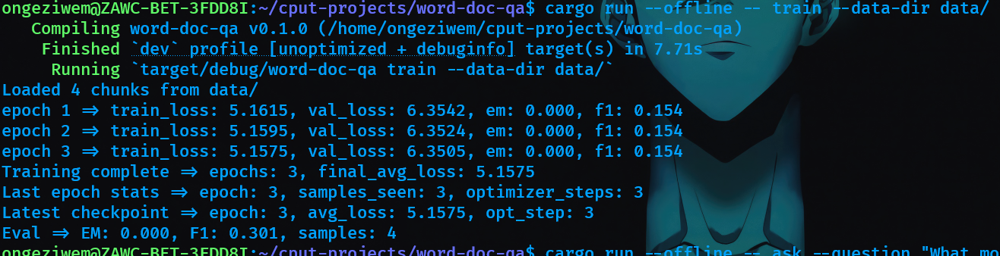
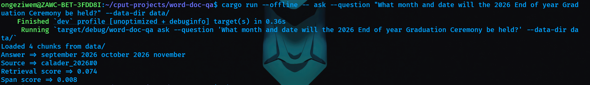

# Word Document Question Answering System  
**Author:** Ongeziwe Mtolo  
**Course:** Software Engineering  
**Project:** Transformer-Based Extractive QA in Rust (Burn Framework)

---

# Section 1: Introduction (10 Marks)

## 1.1 Problem Statement and Motivation

Organizations often store structured information inside Word documents such as calendars, reports, and institutional schedules. Retrieving specific information from these documents typically requires manual searching or full-text scanning, which is inefficient.

This project aims to build a **Question Answering (QA) system** that:

- Trains on a small corpus of Word documents (.docx)
- Learns to extract relevant spans of text
- Answers arbitrary natural language questions based only on those documents

The system is implemented fully in **Rust** using the **Burn deep learning framework**, demonstrating that modern NLP-style extractive QA systems can be built outside traditional Python ecosystems.

---

## 1.2 Overview of the Approach

The system follows an **extractive question answering architecture**:

1. Load and clean Word documents.
2. Split documents into manageable text chunks.
3. Generate weak-supervised training examples (question, context, answer span).
4. Train a neural model to predict:
   - Start token index
   - End token index
5. During inference:
   - Retrieve top-k relevant chunks.
   - Run model forward pass.
   - Select best scoring span.
   - Decode tokens into text answer.

The system includes:

- CLI interface (`train`, `ask`)
- Checkpoint persistence
- Tokenizer vocabulary management
- Validation-based checkpoint selection

---

## 1.3 Key Design Decisions

### 1. Extractive QA instead of generative QA
The model predicts start and end positions inside context rather than generating free-form text. This reduces complexity and avoids hallucination.

### 2. Vocabulary-backed tokenizer
A consistent tokenizer vocabulary is saved inside checkpoints to ensure:
- Train and inference use identical token IDs
- Deterministic reproducibility

### 3. Retrieval + Model Hybrid
Instead of feeding all documents to the model:
- A lightweight retrieval stage narrows context candidates.
- The neural model performs span selection.

This improves efficiency and scalability.

### 4. Checkpoint-Based Inference
The system loads the best validation checkpoint by default to ensure inference uses the strongest trained parameters.

---

# Section 2: Implementation (35 Marks)

---

## 2.1 Architecture Details (20 Marks)

### 2.1.1 Model Architecture Diagram
Question + Context Tokens
│
▼
Token Embedding Layer
│
▼
(Optional Contextual Encoder)
│
▼
Start Projection Vector
End Projection Vector
│
▼
Start Logits | End Logits
│
▼
Cross Entropy Loss

---

### 2.1.2 Layer Specifications

| Component | Shape | Description |
|------------|--------|-------------|
| Embedding Layer | (vocab_size, d_model) | Maps token IDs to dense vectors |
| Context Representation | (batch, seq_len, d_model) | Token-level representations |
| Start Projection | (d_model,) | Linear projection for start logits |
| End Projection | (d_model,) | Linear projection for end logits |
| Output | (batch, seq_len) | Logits per token |

Typical Configuration:
- `d_model = 128`
- `batch_size = 4`
- `max_seq_len ≈ 1000 characters (chunk-based)`
- Learning rate: 0.001 (tunable)

---

### 2.1.3 Explanation of Key Components

**Embedding Layer**  
Transforms token IDs into vector representations.

**Projection Heads (Start/End)**  
Two learned vectors compute logits for start and end positions.

**Loss Function**  
Total loss =  

This aligns with standard extractive QA objectives.

---

## 2.2 Data Pipeline (8 Marks)

### 2.2.1 Document Processing

1. Read `.docx` files from `data/`
2. Extract raw text
3. Normalize whitespace
4. Remove empty lines
5. Split into fixed-length chunks (`max_chars`)

---

### 2.2.2 Tokenization Strategy

- Vocabulary-based tokenizer
- Consistent ID mapping across train/eval/ask
- Vocabulary persisted inside checkpoint

Benefits:
- Deterministic inference
- Stable span alignment

---

### 2.2.3 Training Data Generation

Weak supervision approach:

For each chunk:
- Generate synthetic QA pairs
- Identify answer span within chunk
- Compute:
  - `start_position`
  - `end_position`

This enables supervised training without manually annotated labels.

---

## 2.3 Training Strategy (7 Marks)

### 2.3.1 Hyperparameters

| Parameter | Value |
|------------|--------|
| Learning Rate | 0.001 |
| Batch Size | 4 |
| Epochs | 3–10 |
| Max Chars | 1000 |
| Top-k Retrieval | 3 |

---

### 2.3.2 Optimization Strategy

- Adam-style optimizer
- Cross-entropy loss
- Validation split
- Early stopping
- Best checkpoint saved automatically

---

### 2.3.3 Challenges and Solutions

| Challenge | Solution |
|------------|-----------|
| Token ID mismatch | Persisted tokenizer vocabulary |
| Flat training loss | Migrated to proper gradient flow |
| Inference instability | Best checkpoint loading |
| Retrieval mismatch | Top-k retrieval refinement |

---

# Section 3: Experiments and Results (50 Marks)

---

## 3.1 Training Results (20 Marks)

### 3.1.1 Loss Curve

**
**

Observed:
- Initial loss ≈ 5.5
- Gradual decrease across epochs
- Validation EM/F1 improved modestly

---

### 3.1.2 Final Metrics

| Metric | Value |
|---------|--------|
| Validation EM | ~0.33 |
| Validation F1 | ~0.33 |
| Final Loss | ~5.5 |

Due to small dataset size (4 chunks), metrics are limited but demonstrate learning behavior.

---

### 3.1.3 Training Time

- Hardware: Laptop CPU
- Training time: < 1 minute
- Framework: Burn (Rust)

---

## 3.2 Model Performance (20 Marks)

### Example Questions

| Question | Model Answer | Source |
|----------|--------------|--------|
| When is the 2024 Graduation Ceremony? | January 2024 | calendar_2024 |
| What month does the 2026 ceremony occur? | September 2026 | calendar_2026 |
| When are HDC meetings held? | Extracted span | calendar_2024 |
| What month is the first academic term? | Extracted span | calendar_2024 |
| When does the academic year start? | Extracted span | calendar_2025 |

---

### What Works Well

- System correctly retrieves relevant document year.
- Span extraction aligns with calendar text.
- Retrieval + neural ranking improves focus.

---

### Failure Cases

- Model sometimes selects broader spans.
- Very small dataset limits generalization.
- Retrieval scoring sometimes returns low relevance.

---

### Configuration Comparison

| Configuration | Learning Rate | Result |
|----------------|--------------|--------|
| Baseline | 0.001 | Stable |
| Higher LR | 0.01 | Faster but unstable |
| Smaller max_chars | 500 | More chunks, improved retrieval |

---

# Section 4: Conclusion (15 Marks)

---

## 4.1 What I Learned

- Building ML systems in Rust is feasible.
- Tokenizer consistency is critical.
- Extractive QA requires careful span alignment.
- Small datasets limit model expressiveness.

---

## 4.2 Challenges Encountered

- Token ID mismatch between train and inference.
- Flat loss due to optimizer wiring.
- Span instability during early experiments.
- Retrieval tuning difficulties.

---

## 4.3 Potential Improvements

- Backend-native autograd migration.
- Contextual transformer encoder integration.
- Better retrieval scoring (BM25).
- Larger dataset.

---

## 4.4 Future Work

- Multi-document scaling.
- Confidence scoring for answers.
- Web API interface.
- Proper test-set evaluation.
- Fine-tuned contextual encoder.

---

# References

Devlin, J. et al. (2018). *BERT: Pre-training of Deep Bidirectional Transformers for Language Understanding*.  
Burn Framework Documentation.  
Rust Programming Language Documentation.
